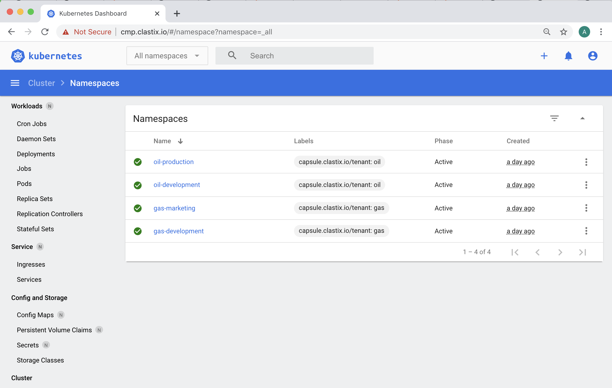

# Capsule Proxy
This project is an add-on for [Capsule](https://github.com/clastix/capsule), the operator providing multi-tenancy in Kubernetes.

## The problem
Kubernetes RBAC lacks the ability to list only the owned cluster-scoped resources since there are no ACL-filtered APIs. For example:

```
$ kubectl get namespaces
Error from server (Forbidden): namespaces is forbidden:
User "alice" cannot list resource "namespaces" in API group "" at the cluster scope
```

However, the user can have permissions on some namespaces

```
$ kubectl auth can-i [get|list|watch|delete] ns oil-production
yes
```

The reason, as the error message reported, is that the RBAC _list_ action is available only at Cluster-Scope and it is not granted to users without appropriate permissions.

To overcome this problem, many Kubernetes distributions introduced mirrored custom resources supported by a custom set of ACL-filtered APIs. However, this leads to radically change the user's experience of Kubernetes by introducing hard customizations that make painfull to move from one distribution to another.

With **Capsule**, we taken a different approach. As one of the key goals, we want to keep the same user's experience on all the distributions of Kubernetes. We want people to use the standard tools they already know and love and it should just work.

## How it works
This project is an add-on of the main [Capsule](https://github.com/clastix/capsule) operator, so make sure you have a working instance of Caspule before to attempt to install it. Use the `capsule-proxy` only if you want Tenant Owners to list their own Cluster-Scope resources.

The `capsule-proxy`  implements a simple reverse proxy that intercepts only specific requests to the APIs server and Capsule does all the magic behind the scenes. 

Current implementation only filter two type of requests:

* `api/v1/namespaces`
* `api/v1/nodes`

All other requestes are proxied transparently to the APIs server, so no side-effects are expected. We're planning to add new APIs in the future, so PRs are welcome!

## Installation
The `capsule-proxy` can be deployed in standalone mode, e.g. running as a pod bridging any Kubernetes client to the APIs server. Optionally, it can be deployed as sidecar container in the backend of a dashboard.

An Helm Chart is available [here](./charts/capsule-proxy/README.md).

## Does it work with kubectl?
Yes, it works by intercepting all the requests from the `kubectl` client directed to the APIs server. It works with both users who use the TLS certificate authentication and those who use OIDC.

As tenant owner `alice`, you are able to use `kubectl` to create some namespaces:
```
$ kubectl --context alice-oidc@mycluster create namespace oil-production
$ kubectl --context alice-oidc@mycluster create namespace oil-development
$ kubectl --context alice-oidc@mycluster create namespace gas-marketing
```

and list only those namespaces:
```
$ kubectl --context alice-oidc@mycluster get namespaces
NAME                STATUS   AGE
gas-marketing       Active   2m
oil-development     Active   2m
oil-production      Active   2m
```

## Does it work with my preferred Kubernetes dashboard?
If you're using a client-only dashboard, for example [Lens](https://k8slens.dev/), the `capsule-proxy` can be used as with `kubectl` since this dashboard usually talks to the APIs server using just a `kubeconfig` file.


For a web based dashboard, like the [Kubernetes Dashboard](https://github.com/kubernetes/dashboard), the `capsule-proxy` can be deployed as a sidecar container in the backend, following the well-known cloud native _Ambassador Pattern_.



## Documentation
You can find more detailed documentation [here](https://github.com/clastix/capsule/blob/master/docs/index.md).

## Contributions
This is an open source software relased with Apache2 [license](./LICENSE). Feel free to open issues and pull requests. You're welcome!
